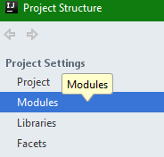

# Processing sample projects

Sample projects for Processing for use in IntelliJ IDEA.

It's as simple as it sounds: Just copy the code and begin programming!

___

To configure the libraries, follow these simple steps:

1. Open up the *Project Structure* (Ctrl+Alt+Shift+S):  

1. Go to *Global Libraries*:  

1. Add the needed libraries using Maven:  

    1. Search and add `org.jogamp.gluegen:gluegen-rt`:  
    
    Repeat this step for `org.jogamp.jogl:jogl-all` and `org.processing:core`.  
    Use the latest version available or any one you like.
    
1. Switch to *Modules*:  
   

    1. Add the libraries you just downloaded:  
    
        1. Add the libraries:  
        
        
        1. Select the libraries:  
        
    
        1. Hit OK:  
        
    
1. Launch the sample:  

